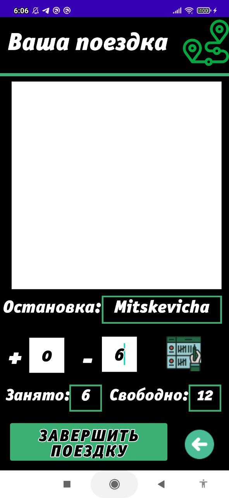

# Android-app-for-taxi
A mobile application that consists of 3 parts: a server, 
an application for clients(RouteTaxi[TaxiLink]) 
and an application for drivers(DriverLink[DriverLink]).

# Server
The server is written in Java11+Spring+Hibernate+
MySQL+Maven+Google Cloud(App Engine + Cloud SQL).
Server features:
1. Getting all routes;
2. Obtaining data about the car and driver by route number;
3. Getting all routes on the stops that are contained on this route;
4. Receiving a route according to the driver's data;
5. Getting all stops;
6. Getting all stops by route number;
7. Getting a stop by id;
8. Getting a car by id;
9. Getting car capacity by id;
10. Getting data about the driver by id;
11. Authorization of the driver (since they are entered in the database in advance);
12. Creation of a trip according to the route and user;
13. Deleting a trip by user (the user is also deleted from the database by CASCADE);
14. Creation of the user according to the initial and final stops chosen by him.

# DataBase: MySQL 8.0
Database structure:

    

# TaxiLink

    
    
    
    
    

 

Trip booking method No. 1

    
    
    
    
    

 

Trip booking method No. 2:

    
    
    
    
    
    

 

# DriverLink

    
    
    
    
    
    
    

